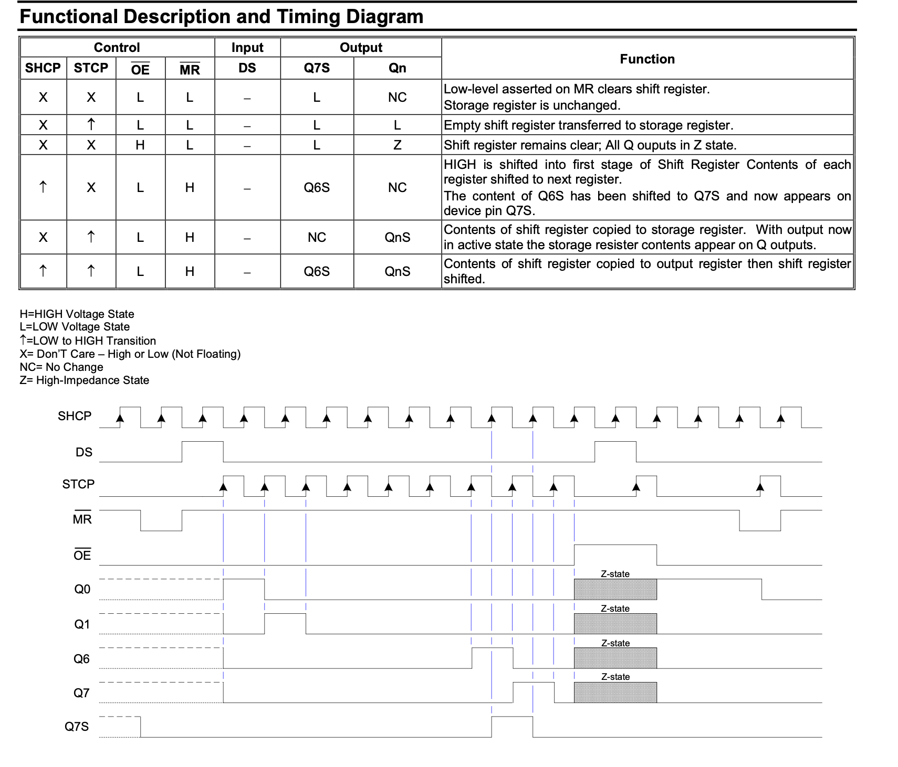

# 74HC595 Shift Register Driver

The 74HC595 is an eight bit shift register accepts data from the serial input (DS) on each positive transition of the shift register clock (SHCP). When asserted low the reset function (`NOT MR`) sets all shift register values to zero and is indepent of all clocks. This driver is written in [Lucid](https://alchitry.com/lucid) and is meant to be run on [Alchitry Au](https://www.sparkfun.com/products/16527) Boards + [Alchitry Br](https://www.sparkfun.com/products/16524) prototype element board.

## Demo

The code is set to run with two 74HC595 daisy-chained by default. You can modify the `CHAIN` value depending on your hardware setup (read below).

### How to run

Upon compile and successful load, **press** `io_button[0]` to load the first letter "D" into both 8-sets of LEDs.

You can modify the `TEST` constant in `au_top` to load any value you want:

```
  const D = $reverse(b00111101); // pump 0 first, then 0, then 1, then 1, ...
  const A = $reverse(b01110111);
  const E = $reverse(b01001111);
  const B = $reverse(b00011111);

  const TEST = {B, E, A, D}; // pump D first, then A, then E, then B
```

## Usage

The driver outputs 5 signal: `ds, shcp, stcp, oe, mr` to the first shift register in the chain, and a `busy` signal to indicate whether it is ready to receives new sets of data or not. It receives `data` (`CHAIN * 8` bits) for all shift registers in the chain, and a `new` signal to move it out of the `IDLE` state (see FSM details below).

They're set to the following `Br` pins:

```
    // --------- OUTPUT SIGNALS ---------- //
    // connect oe, mr, shcp, and stcp to all shift registers in the chain
    // connect ds to the first shift register in the chain
    io_seg[4] = driver.oe; // pin A45, output enable (LOW to show output at Q0 to Q7)
    io_seg[3] = driver.mr; // pin A46, shift register reset (LOW to reset, otherwise remain HIGH)
    io_seg[2] = driver.shcp; // pin A48, shift register clock
    io_seg[7] = driver.stcp; // pin A49, storage register clock
    io_seg[5] = driver.ds; // pin A3, data to shift register
    // ---------------------------- //
```

You can modify `CHAIN` when instantiating `driver_74hc595` module depending on how many shift register are daisy chained. `SPEED` can also be varied when instantiating that module in case you want to debug, but the smallest recommended value is 5.

View the timing diagram in the datasheet to know how `74HC595` works:



### Driver FSM

The driver has several states:

1. `IDLE`: you can supply `new` signal and it will store `data` to `current_data` dff
2. `LOAD`: here we wait for the next `shiftreg_clock_edge` before setting `shcp` to `shiftreg_clock` so not to lose the first bit of data
3. `TRANSFER`: loops here until all `CHAIN*8` bits are pumped out via `ds`
4. `LATCH`: once all data is transferred, we set `stcp` to `1` so all 8 storage registers latches onto the output of all shift registers
5. `RESET`: finally, we reset the shift register contents to 0 and go to `IDLE` state, ready for new input
